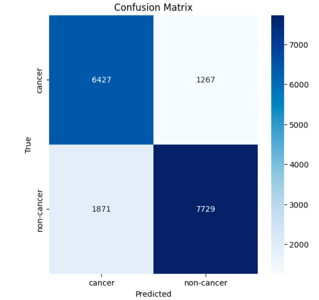
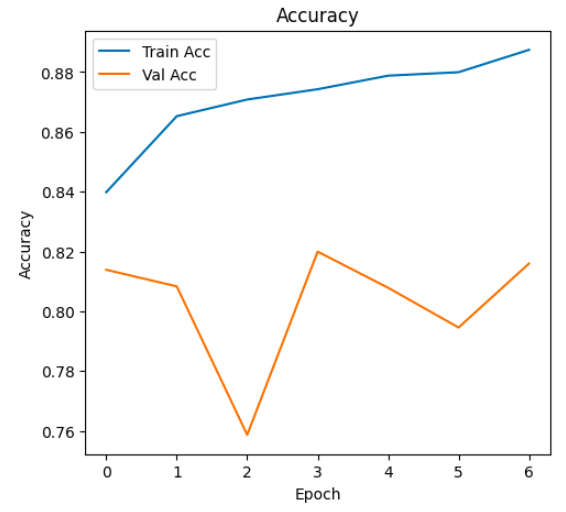
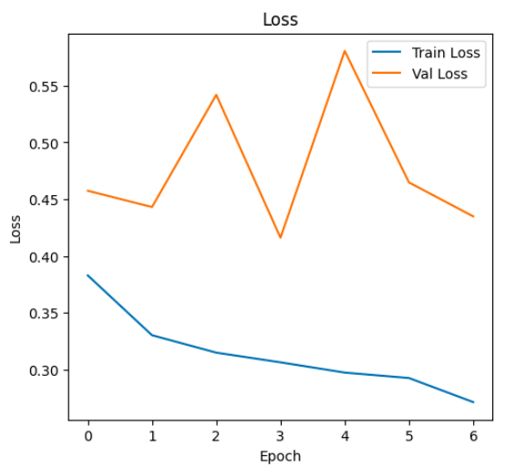

# 🧬 Breast Histopathology Image Classification using CNNs & Transfer Learning  

## 📌 Project Overview  
This project focuses on building an AI model for detecting breast cancer from histopathology images. The dataset consists of thousands of patient biopsy image patches that are split into two categories: **cancerous** and **non-cancerous**.  

Our objective was to apply **Deep Learning techniques (CNNs & Transfer Learning)** to extract meaningful features from the images and build robust models capable of accurately classifying them.  

---

## 📂 Dataset  
- **Source:** [IDC_regular_ps50_idx5.zip](http://gleason.case.edu/webdata/jpi-dl-tutorial/IDC_regular_ps50_idx5.zip)
- **Reference:** [Kaggle Dataset](https://www.kaggle.com/datasets/paultimothymooney/breast-histopathology-images/data)
- **Acknowledgements:**  
  - [NIH PubMed Paper](https://www.ncbi.nlm.nih.gov/pubmed/27563488)  
  - [SPIE Conference Paper](http://spie.org/Publications/Proceedings/Paper/10.1117/12.2043872)  

The dataset contains histopathology image patches of breast cancer, labeled as **cancer** or **not cancer**.  

---

## 🛠️ Major Libraries Used  
- **TensorFlow/Keras** → Model creation, training, and data augmentation  
- **Matplotlib** → Visualization of results (accuracy/loss graphs, confusion matrices)  

---

## 🔑 Steps Followed  

1. **Data Preparation**  
   - Selected ~250 patients from the dataset.  
   - Split into two folders: `cancer` and `not_cancer`.  

2. **Data Augmentation**  
   - Applied synthetic variations using **ImageDataGenerator** (rotation, flipping, zoom, etc.).  
   - Helped enrich the dataset and improve generalization.  

3. **Train-Test Split**  
   - Created separate training and testing datasets for evaluation.  

4. **Model Development**  
   Implemented and compared multiple models using **Transfer Learning** and training from scratch:  
   - ✅ VGG16 (Imagenet weights, frozen base layers)  
   - ✅ VGG16 (Imagenet weights, unfreezing top 4 base layers)  
   - ✅ EfficientNetB0 (all layers trainable from scratch)  
   - ✅ EfficientNetB3 (all layers trainable from scratch)  
   - ✅ VGG16 (Imagenet weights, partial unfreezing of multiple layers)  
   - ✅ VGG16 (Imagenet weights, all layers unfrozen, full retraining)  
   - ✅ DenseNet121 (all layers trainable)  
   - ✅ DenseNet169 (all layers trainable)  

5. **Training Techniques**  
   - Used **EarlyStopping** to prevent overfitting.  
   - Applied **ReduceLROnPlateau** for adaptive learning rate scheduling.  
   - Added **Dropout layers** for regularization and improved generalization.  

6. **Evaluation**  
   - Plotted **accuracy and loss curves** (training vs validation).  
   - Visualized **confusion matrices** to assess classification performance.  

---

## 📊 Results  

- **DenseNet169**  
  - Accuracy: **84%**  
  - F1-Score: **0.82**  
  - Recall: Slightly lower compared to DenseNet121  

- **DenseNet121**  
  - Accuracy: **82.5%**  
  - F1-Score: **0.82**  
  - Recall: **Better recall for cancer detection**  

⚡ **Key Insight:**  
Although DenseNet169 achieves a slightly higher overall accuracy, DenseNet121 shows **better recall for cancer cases**. In medical imaging tasks, recall (sensitivity) is crucial since missing a cancer case is riskier than false positives.  

👉 **Recommendation:** For breast cancer histopathology classification, **DenseNet121** may be the more reliable choice due to its stronger recall performance, even if the accuracy is marginally lower.  

**Confusion Matrix:**  
  

**Training vs Validation Accuracy:**  
  

**Training vs Validation Loss:**  
  

---

## ✅ Conclusion  
This project provided hands-on experience with:  
- Handling large-scale histopathology datasets  
- Applying **data augmentation** to improve robustness  
- Comparing multiple **CNN architectures** (VGG16, EfficientNet, DenseNet)  
- Using **regularization (Dropout)** and training optimizations (EarlyStopping, LR scheduling)  
- Evaluating models with both **metrics and visualizations**  

📌 **Final Takeaway:** DenseNet variants (especially DenseNet121 and DenseNet169) provided the best results. While DenseNet169 achieved higher accuracy, DenseNet121 demonstrated stronger recall, making it a **preferred model for cancer detection tasks** where sensitivity is critical. 
